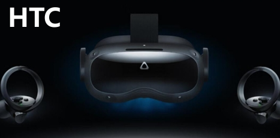
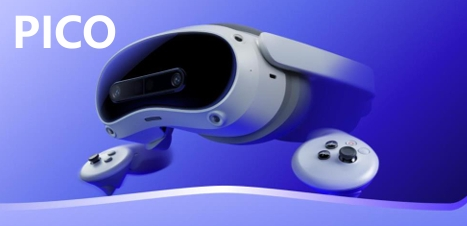

# INSIDOUS 
大空间VR文旅 一站式平台

扫场与部署、动线管理、登记、中控与场控、数据复盘

## 特点

### 如果你是内容方、IP方，我们提供

* `内容适应不同场地的能力`  
无需修改内容，只需接入平台SDK，就可以让内容具备自适应不同面积，不同形状场地的能力  

* `内容不外泄的能力`  
接入到平台的内容全程为加密的特殊格式，而非传统的执行程序，没有平台的认证，任何地方都不可以运行  

* `实时获取内容全球运营数据的能力`  
提供随时随地可以打开的数据后台，随时掌握旗下内容的实时数据，包括位置、场地、人次等。商业合作有据可依  

### 如果你是场地方、运营方，我们提供

* `48小时快速场地部署的能力`  
时间就是金钱，也是场租，我们懂你，所以我们通过集成式部署工具，让你在开场前，能48小时内完成所有部署  

* `超高效场地运营的能力`  
一个场地，多个内容；一个内容，多条动线；上百人同场，随到随走；支持热更新，实现超高坪效比  

* `场地运营数据复盘的能力`  
提供场地运营的详细数据，包括时间，人次，时长等，提供图表化的展示归纳工具，协助你做好每天的运营数据复盘  

### 多设备支持
Multiple-devices support  

市面主流的大空间VR设备我们都适配无论是HTC还是PICO  

